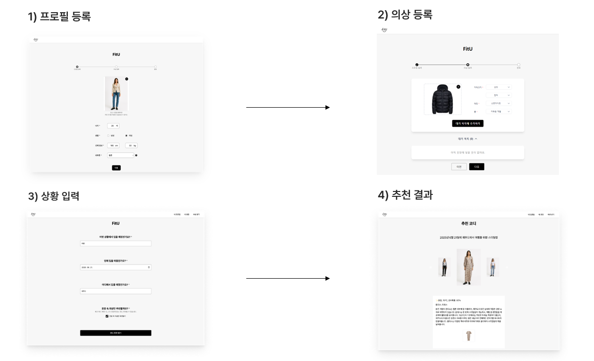

# AI 기반 개인 맞춤 의상 추천 시스템 팀프로젝트

## 📅 프로젝트 개요

사용자 프로필, 의상 기반 특정 상황에 맞는 옷 스타일을 AI가 추천해주는 서비스

- **팀 구성:** AI 담당 1명, 프론트엔드/백엔드 담당 3명
- **프로젝트 설명:** 
  - 사용자 프로필과 보유 의상을 기반으로 특정 상황(날짜, 장소 등)에 맞는 최적의 스타일링을 AI가 추천하는 서비스. 
  - 사용자가 가지고 있지 않은 옷도 가상으로 생성하여 피팅 시뮬레이션을 제공.
- **협업 툴:** Discord, Figma, Git/GitHub

## ✨ 핵심 기능

- **AI 스타일링 추천:** 사용자 프로필, 등록된 의상, 특정 상황(날짜, 장소)을 종합하여 최적의 3가지 스타일링 추천
- **가상 의상 생성 및 피팅:** 사용자가 보유하지 않은 의상을 AI로 가상 생성하고, 가상 피팅 시뮬레이션 결과 제공

## 📸 AI 스타일링 핵심 기능 예시 화면

## 🛠️ 기술 스택

| 구분 | 기술 |
| --- | --- |
| **Backend** | `Spring Boot`, `JPA`, `QueryDSL`, `MySQL` |
| **Frontend**| `React`, `Vite`, `Zustand` |
| **AI** | `Fashion AI`, `OpenAI`, `Efficientnet_v2_s`, `YOLOv12s`, `DALL·E 3`, `Google Colab`, `Roboflow`, `Python`, `FastAPI` | 
| **Infra** | `AWS EC2`, `S3`, `RDS`, `Elastic Beanstalk`, `Amplify`, `Nginx` |

## 👨‍💻 주요 담당 부분

- **요구사항 분석 및 설계:** 기능 명세서 및 ERD 작성
- **전반적인 의상 관리 기능 개발:**
    - 의상 등록 페이지 구현 (이미지 업로드 → AI 분석 → 결과 매핑)
    - 사용자 프로필과 의상 정보를 취합하여 S3 및 RDS에 저장하는 로직 구현
    - 의상 조회(전체/조건별), 수정, 삭제 기능 개발
- **상태 관리:** `Zustand`를 활용한 사용자 프로필 정보 전역 상태 관리
- **배포 및 인프라 관리:**
    - `AWS Amplify`를 이용한 프론트엔드 배포
    - `AWS Elastic Beanstalk`, `EC2`, `RDS`, `Nginx`를 활용한 백엔드 배포
    