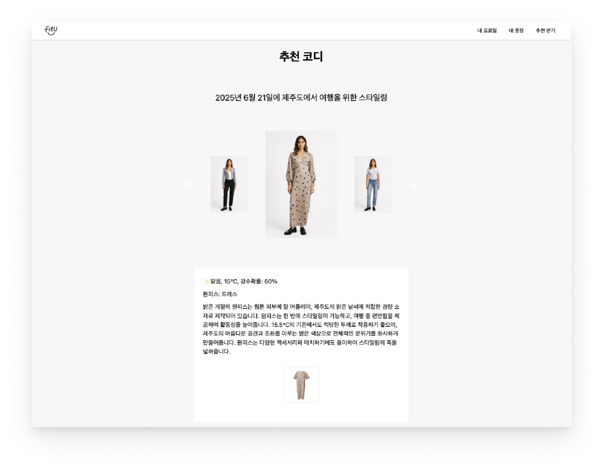

# AI 기반 개인 맞춤 의상 추천 시스템 팀프로젝트

## 📅 프로젝트 개요

이 레포지토리는 팀 프로젝트의 결과물을 재구성한 저장소입니다. 제가 기여한 부분을 기반으로 저의 역할을 명확히 보여주기 위해 작성되었습니다.

- **프로젝트 기간:** 2개월(2025.04.24 ~ 2025.06.24)
- **팀 구성:** AI 담당 1명, 프론트엔드/백엔드 담당 3명
- **프로젝트 설명:** 
  - 사용자 프로필과 보유 의상을 기반으로 특정 상황(날짜, 장소 등)에 맞는 최적의 스타일링을 AI가 추천하는 서비스. 
  - 사용자가 가지고 있지 않은 옷도 가상으로 생성하여 피팅 시뮬레이션을 제공.
- **협업 툴:** Discord, Figma, Git/GitHub
- **원본 팀 프로젝트 링크:** [TEAM-FitU](https://github.com/orgs/TEAM-FitU/repositories)
  - **주요 기여 브랜치**: 프론트: FitU-FE -> 브랜치 feat/6, 백엔드: FitU-BE -> 브랜치 feat/7, feat/11

## ✨ 핵심 기능

- **AI 스타일링 추천:** 사용자 프로필, 등록된 의상, 특정 상황(날짜, 장소)을 종합하여 최적의 3가지 스타일링 추천
- **가상 의상 생성 및 피팅:** 사용자가 보유하지 않은 의상을 AI로 가상 생성하고, 가상 피팅 시뮬레이션 결과 제공

## 📸 AI 스타일링 추천 결과 예시 화면

## 🛠️ 기술 스택

| 구분 | 기술 |
| --- | --- |
| **Backend** | `Spring Boot`, `JPA`, `QueryDSL`, `MySQL` |
| **Frontend**| `React`, `Vite`, `Zustand` |
| **AI** | `Fashion AI`, `OpenAI`, `Efficientnet_v2_s`, `YOLOv12s`, `DALL·E 3`, `Google Colab`, `Roboflow`, `Python`, `FastAPI` | 
| **Infra** | `AWS EC2`, `S3`, `RDS`, `Elastic Beanstalk`, `Amplify`, `Nginx` |

## 👨‍💻 담당 역할 및 기여

- **요구사항 분석 및 설계:** 기능 명세서 및 ERD 작성
- **의상 관리 기능 개발:**
    - 의상 등록 페이지 구현 (이미지 업로드 → AI 분석 → 결과 매핑)
    - 사용자 프로필과 의상 정보를 취합하여 S3 및 RDS에 저장하는 로직 구현
    - 의상 조회(전체/조건별), 수정, 삭제 기능 개발
- **상태 관리:** `Zustand`를 활용한 사용자 프로필 정보 전역 상태 관리
- **배포 및 인프라 관리:**
    - `AWS Amplify`를 이용한 프론트엔드 배포
    - `AWS Elastic Beanstalk`, `EC2`, `RDS`, `Nginx`를 활용한 백엔드 배포

## 🌱 성장 및 학습

- **Git 기반 협업:** `main`/`develop` 브랜치 전략 및 `feat/*` 기능 브랜치를 활용하고, `issue`와 `Pull Request` 기반의 코드 리뷰 및 협업 프로세스 경험
- **커뮤니케이션 및 문제 해결:** 팀 회의를 통해 다양한 의견을 조율하고, 근거에 기반하여 기술적 문제를 해결하며 공동의 목표 달성
- **풀스택 개발 경험:** 프론트엔드(React)와 백엔드(Spring Boot) 양쪽에서 의상 관리 기능을 책임지고 개발 
- **클라우드 및 AI 연동:** AWS 클라우드 환경 배포를 수행하고, AI 모델 API를 백엔드 시스템과 연동하여 서비스에 통합